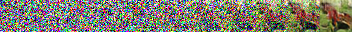
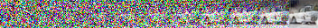
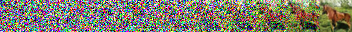
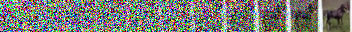
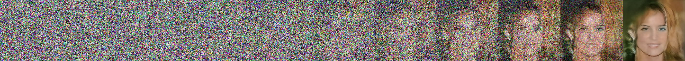
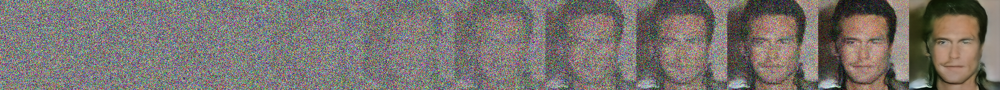
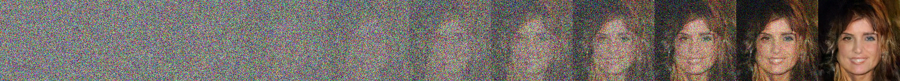
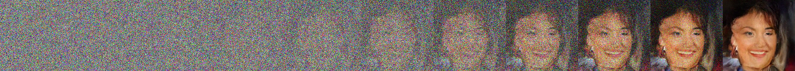

# PyTorch Gaussian Diffusion
This repository is an implementation of Guassian Diffusion model for image. Although the code is concentrated on image, the gaussian diffusion module iteself does not make the assumption that inputs are image. It is the neural network used during diffusion highly related to data type. We aim to implement Gaussian diffuion module straightforwardly.

## Gaussian Diffusion
### Basic Assumption

The data distribution is gradually converted into a well behaved (analytically tractable) distribution $\pi(\mathbf{y})$ by repeated application of a Markov diffusion kernel $T_{\pi}(\mathbf{y}\vert \mathbf{y}';\beta)$ for $\pi(\mathbf{y})$, where $\beta$ is the diffusion rate.

$$
\pi(\mathbf{y})=\int{T_{\pi}(\mathbf{y}\vert \mathbf{y}';\beta)\pi(\mathbf{y}')\ d\mathbf{y}'}
$$

We model the conditional probability under this Markov chain at timestamp $t$ as an isotropic Gaussian:

$$
q(\mathbf{x}^{(t)}\vert \mathbf{x}^{(0\cdots(t-1))})=q(\mathbf{x}^{(t)}\vert \mathbf{x}^{(t-1)})=T_{\pi}(\mathbf{x}^{(t)}\vert \mathbf{x}^{(t-1)};\beta_t)=\mathcal{N}(\mathbf{x}^{(t)};\sqrt{1-\beta_t}\mathbf{x}^{(t-1)},\beta_t\mathbf{I}),
$$

and the joint distribution across time $T$ is as:

$$
q(\mathbf{x}^{(0\cdots T)})=q(\mathbf{x}^{(0)})\prod_{t=1}^T q(\mathbf{x}^{(t)}\vert \mathbf{x}^{(0\cdots(t-1))})=q(\mathbf{x}^{(0)})\prod_{t=1}^T q(\mathbf{x}^{(t)}\vert \mathbf{x}^{(t-1)}).
$$

For continuous Guassian diffusion (limit of small step size $\beta_t$), the reversal of the diffusion process has the identical functional form as the forward process ([On the theory of stochastic processes, with particular reference to applications, W. Feller, 1949](https://www.semanticscholar.org/paper/On-the-Theory-of-Stochastic-Processes%2C-with-to-Feller/4cdcf495232f3ec44183dc74cd8eca4b44c2de64)). Therefore, if $\beta_t$ is small, $q(\mathbf{x}^{(t-1)}\vert \mathbf{x}^{(t)})$ should also be a Gaussian. Similar to Variational Autoencoder (VAE), we use $p(\mathbf{x}^{(t-1)}\vert \mathbf{x}^{(t)})=\mathcal{N}(\mathbf{x}^{(t-1)};f_\boldsymbol{\mu}^{(t)}(\mathbf{x}^{(t)}),f_{\boldsymbol{\Sigma}}^{(t)}(\mathbf{x}^{(t)}))$ to recognize this distribution in the reverse Markov process. We also assume that at the end of the diffusion process $p(\mathbf{x}^{(T)})=\pi(\mathbf{x}^{(T)})=\mathcal{N}(\mathbf{x}^{(T)};\mathbf{0},\mathbf{I})$. Then the probability of the original data $\mathbf{x}^{(0)}$ under this process is:

$$
p(\mathbf{x}^{(0)})=\int p(\mathbf{x}^{(0\cdots T)})\ d\mathbf{x}^{(1\cdots T)}=\int p(\mathbf{x}^{(T)}) \prod_{t=1}^T p(\mathbf{x}^{(t-1)}\vert \mathbf{x}^{(t\cdots T)}) \ d\mathbf{x}^{(1\cdots T)} =\int p(\mathbf{x}^{(T)}) \prod_{t=1}^T p(\mathbf{x}^{(t-1)}\vert \mathbf{x}^{(t)})\ d\mathbf{x}^{(1\cdots T)}.
$$

### Objective Function

The common objective function in data modeling, cross entropy loss becomes:

$$
L=\int q(\mathbf{x}^{(0)}) \log p(\mathbf{x}^{(0)}) \ d\mathbf{x}^{(0)}=\int q(\mathbf{x}^{(0)}) \log (\int p(\mathbf{x}^{(T)}) \prod_{t=1}^T p(\mathbf{x}^{(t-1)}\vert\mathbf{x}^{(t)})\ d\mathbf{x}^{(1\cdots T)})\ d\mathbf{x}^{(0)}.
$$

In this form, the link between $p$ and $q$ is "weak" as there is no measure about how well $p$ and $q$ complement each other at time stemp $t$. Recall that $q$ also has an similar product expression, hence we can rewrite:

$$
\begin{split}
L&=\int q(\mathbf{x}^{(0)}) \log (\int p(\mathbf{x}^{(T)}) \prod_{t=1}^T p(\mathbf{x}^{(t-1)}\vert \mathbf{x}^{(t)})\ d\mathbf{x}^{(1\cdots T)})\ d\mathbf{x}^{(0)}\\
 &=\int q(\mathbf{x}^{(0)}) \log (\int p(\mathbf{x}^{(T)}) \frac{q(\mathbf{x}^{(0\cdots T)})}{q(\mathbf{x}^{(0)})} \prod_{t=1}^T \frac{p(\mathbf{x}^{(t-1)}\vert\mathbf{x}^{(t)})}{q(\mathbf{x}^{(t)}\vert \mathbf{x}^{(t-1)})}\ d\mathbf{x}^{(1\cdots T)})\ d\mathbf{x}^{(0)}.
\end{split}
$$

There is a multiple integral in the $\log$ function which makes it hard to calcuate. Note that 

$$
\frac{q(\mathbf{x}^{(0\cdots T)})}{q(\mathbf{x}^{(0)})}=q(\mathbf{x}^{(1\cdots T)}\vert \mathbf{x}^{(0)})
$$

is a probability density function in the internal multiple integral, which means that $\int q(\mathbf{x}^{(1\cdots T)}\vert \mathbf{x}^{(0)})\ d\mathbf{x}^{(1\cdots T)}=1$. Using Jensen's inequality, instead of directly optimizing $L$, we optimize the lower bound $K$ of it:

$$
\begin{split}
L&=\int q(\mathbf{x}^{(0)}) \log (\int p(\mathbf{x}^{(T)}) \frac{q(\mathbf{x}^{(0\cdots T)})}{q(\mathbf{x}^{(0)})} \prod_{t=1}^T \frac{p(\mathbf{x}^{(t-1)}\vert \mathbf{x}^{(t)})}{q(\mathbf{x}^{(t)}\vert \mathbf{x}^{(t-1)})}\ d\mathbf{x}^{(1\cdots T)})\ d\mathbf{x}^{(0)}\\
 &\geq \int q(\mathbf{x}^{(0)}) (\int \frac{q(\mathbf{x}^{(0\cdots T)})}{q(\mathbf{x}^{(0)})} \log ( p(\mathbf{x}^{(T)}) \prod_{t=1}^T \frac{p(\mathbf{x}^{(t-1)}\vert \mathbf{x}^{(t)})}{q(\mathbf{x}^{(t)}\vert\mathbf{x}^{(t-1)})})\ d\mathbf{x}^{(1\cdots T)})\ d\mathbf{x}^{(0)}=K.
\end{split}
$$

Combining the integral expression and changing the product to sum, we have:

$$
\begin{split}
K&=\int q(\mathbf{x}^{(0\cdots T)}) \sum_{t=1}^T \log \frac{p(\mathbf{x}^{(t-1)}\vert \mathbf{x}^{(t)})}{q(\mathbf{x}^{(t)}\vert \mathbf{x}^{(t-1)})}\ d\mathbf{x}^{(0\cdots T)}+\int q(\mathbf{x}^{(0\cdots T)}) \log p(\mathbf{x}^{(T)})\ d\mathbf{x}^{(0\cdots T)}\\
 &=\sum_{t=1}^T \int q(\mathbf{x}^{(0\cdots T)}) \log \frac{p(\mathbf{x}^{(t-1)}\vert \mathbf{x}^{(t)})}{q(\mathbf{x}^{(t)}\vert \mathbf{x}^{(t-1)})}\ d\mathbf{x}^{(0\cdots T)}+\int q(\mathbf{x}^{(0\cdots T)}) \log p(\mathbf{x}^{(T)})\ d\mathbf{x}^{(0\cdots T)}.
\end{split}
$$

In each term, some variables of the multiple integral do not influence the calculation. We remove these variables except $\mathbf{x}^{(0)}$ to keep the connection between intermediate codes and the original data. This leads to:

$$
\begin{split}
K=& \sum_{t=2}^T \int q(\mathbf{x}^{(0)},\mathbf{x}^{(t-1)},\mathbf{x}^{(t)}) \log \frac{p(\mathbf{x}^{(t-1)}\vert \mathbf{x}^{(t)})}{q(\mathbf{x}^{(t)}\vert \mathbf{x}^{(t-1)})}\ d\mathbf{x}^{(0)}\ d\mathbf{x}^{(t-1)}\ d\mathbf{x}^{(t)}\\
 & +\int q(\mathbf{x}^{(0)},\mathbf{x}^{(1)}) \log \frac{p(\mathbf{x}^{(0)}\vert \mathbf{x}^{(1)})}{q(\mathbf{x}^{(1)}\vert \mathbf{x}^{(0)})}\ d\mathbf{x}^{(0)}\ d\mathbf{x}^{(1)}+\int q(\mathbf{x}^{(0)},\mathbf{x}^{(T)}) \log p(\mathbf{x}^{(T)})\ d\mathbf{x}^{(0)}\ d\mathbf{x}^{(T)}.
\end{split}
$$

Each term in the sum can be rewrited as:

$$
\begin{split}
& \int q(\mathbf{x}^{(0)},\mathbf{x}^{(t-1)},\mathbf{x}^{(t)}) \log \frac{p(\mathbf{x}^{(t-1)}\vert \mathbf{x}^{(t)})}{q(\mathbf{x}^{(t)}\vert \mathbf{x}^{(t-1)})}\ d\mathbf{x}^{(0)}\ d\mathbf{x}^{(t-1)}\ d\mathbf{x}^{(t)}\\
= & \int q(\mathbf{x}^{(0)},\mathbf{x}^{(t)}) (\int q(\mathbf{x}^{(t-1)}\vert \mathbf{x}^{(0)},\mathbf{x}^{(t)}) \log \frac{p(\mathbf{x}^{(t-1)}\vert \mathbf{x}^{(t)})}{q(\mathbf{x}^{(t)}\vert \mathbf{x}^{(t-1)})}\ d\mathbf{x}^{(t-1)})\ d\mathbf{x}^{(0)}\ d\mathbf{x}^{(t)}\\
= & \int q(\mathbf{x}^{(0)},\mathbf{x}^{(t)})f(\mathbf{x}^{(0)},\mathbf{x}^{(t)})\ d\mathbf{x}^{(0)}\ d\mathbf{x}^{(t)}.
\end{split}
$$

Expand $f(\mathbf{x}^{(0)},\mathbf{x}^{(t)})$, we have:

$$
\begin{split}
f(\mathbf{x}^{(0)},\mathbf{x}^{(t)}) & =\int q(\mathbf{x}^{(t-1)}\vert \mathbf{x}^{(0)},\mathbf{x}^{(t)}) \log \frac{p(\mathbf{x}^{(t-1)}\vert \mathbf{x}^{(t)})}{q(\mathbf{x}^{(t)}\vert \mathbf{x}^{(t-1)})}\ d\mathbf{x}^{(t-1)}\\
 & =\int q(\mathbf{x}^{(t-1)}\vert \mathbf{x}^{(0)},\mathbf{x}^{(t)}) \log \frac{p(\mathbf{x}^{(t-1)}\vert \mathbf{x}^{(t)})}{q(\mathbf{x}^{(t)}\vert \mathbf{x}^{(t-1)},\mathbf{x}^{(0)})}\ d\mathbf{x}^{(t-1)}\\
 & =\int q(\mathbf{x}^{(t-1)}\vert \mathbf{x}^{(0)},\mathbf{x}^{(t)}) \log \frac{p(\mathbf{x}^{(t-1)}\vert \mathbf{x}^{(t)})q(\mathbf{x}^{(0)},\mathbf{x}^{(t-1)})}{q(\mathbf{x}^{(t-1)}\vert \mathbf{x}^{(t)},\mathbf{x}^{(0)})q(\mathbf{x}^{(0)},\mathbf{x}^{(t)})}\ d\mathbf{x}^{(t-1)}.
\end{split}
$$

Hence, the integral:

$$
\begin{split}
& \int q(\mathbf{x}^{(0)},\mathbf{x}^{(t)})f(\mathbf{x}^{(0)},\mathbf{x}^{(t)})\ d\mathbf{x}^{(0)}\ d\mathbf{x}^{(t)}\\
=& \int q(\mathbf{x}^{(0)},\mathbf{x}^{(t)})(\int q(\mathbf{x}^{(t-1)}\vert \mathbf{x}^{(0)},\mathbf{x}^{(t)}) \log \frac{p(\mathbf{x}^{(t-1)}\vert \mathbf{x}^{(t)})q(\mathbf{x}^{(0)},\mathbf{x}^{(t-1)})}{q(\mathbf{x}^{(t-1)}\vert \mathbf{x}^{(t)},\mathbf{x}^{(0)})q(\mathbf{x}^{(0)},\mathbf{x}^{(t)})}\ d\mathbf{x}^{(t-1)})\ d\mathbf{x}^{(0)}\ d\mathbf{x}^{(t)}\\
=& -\int q(\mathbf{x}^{(0)},\mathbf{x}^{(t)}) D_{KL}(q(\mathbf{x}^{(t-1)}\vert \mathbf{x}^{(0)},\mathbf{x}^{(t)})\Vert p(\mathbf{x}^{(t-1)}\vert \mathbf{x}^{(t)})) \ d\mathbf{x}^{(0)}\ d\mathbf{x}^{(t)}\\
& +\int q(\mathbf{x}^{(0)},\mathbf{x}^{(t-1)},\mathbf{x}^{(t)}) \log \frac{q(\mathbf{x}^{(0)},\mathbf{x}^{(t-1)})}{q(\mathbf{x}^{(0)},\mathbf{x}^{(t)})}\ d\mathbf{x}^{(0)}\ d\mathbf{x}^{(t-1)}\ d\mathbf{x}^{(t)}
\end{split}
$$

Note that:

$$
\begin{split}
&\int q(\mathbf{x}^{(0)},\mathbf{x}^{(t-1)},\mathbf{x}^{(t)}) \log \frac{q(\mathbf{x}^{(0)},\mathbf{x}^{(t-1)})}{q(\mathbf{x}^{(0)},\mathbf{x}^{(t)})}\ d\mathbf{x}^{(0)}\ d\mathbf{x}^{(t-1)}\ d\mathbf{x}^{(t)}\\
=&\int q(\mathbf{x}^{(0)},\mathbf{x}^{(t-1)},\mathbf{x}^{(t)}) \log \frac{q(\mathbf{x}^{(t-1)}\vert \mathbf{x}^{(0)})}{q(\mathbf{x}^{(t)}\vert \mathbf{x}^{(0)})}\ d\mathbf{x}^{(0)}\ d\mathbf{x}^{(t-1)}\ d\mathbf{x}^{(t)}\\
=&\int q(\mathbf{x}^{(0)},\mathbf{x}^{(t-1)}) \log q(\mathbf{x}^{(t-1)}\vert \mathbf{x}^{(0)})\ d\mathbf{x}^{(0)}\ d\mathbf{x}^{(t-1)}-\int q(\mathbf{x}^{(0)},\mathbf{x}^{(t)}) \log q(\mathbf{x}^{(t)}\vert \mathbf{x}^{(0)})\ d\mathbf{x}^{(0)}\ d\mathbf{x}^{(t)}.
\end{split}
$$

The expression of $K$ becomes:

$$
\begin{split}
K=&-\sum_{t=2}^T \int q(\mathbf{x}^{(0)},\mathbf{x}^{(t)}) D_{KL}(q(\mathbf{x}^{(t-1)}\vert \mathbf{x}^{(0)},\mathbf{x}^{(t)})\Vert p(\mathbf{x}^{(t-1)}\vert \mathbf{x}^{(t)})) \ d\mathbf{x}^{(0)}\ d\mathbf{x}^{(t)}\\
 &+\sum_{t=2}^T (\int q(\mathbf{x}^{(0)},\mathbf{x}^{(t-1)}) \log q(\mathbf{x}^{(t-1)}\vert \mathbf{x}^{(0)})\ d\mathbf{x}^{(0)}\ d\mathbf{x}^{(t-1)}-\int q(\mathbf{x}^{(0)},\mathbf{x}^{(t)}) \log q(\mathbf{x}^{(t)}\vert \mathbf{x}^{(0)})\ d\mathbf{x}^{(0)}\ d\mathbf{x}^{(t)})\\
 &+\int q(\mathbf{x}^{(0)},\mathbf{x}^{(1)}) \log \frac{p(\mathbf{x}^{(0)}\vert \mathbf{x}^{(1)})}{q(\mathbf{x}^{(1)}\vert \mathbf{x}^{(0)})}\ d\mathbf{x}^{(0)}\ d\mathbf{x}^{(1)}+\int q(\mathbf{x}^{(0)},\mathbf{x}^{(T)}) \log p(\mathbf{x}^{(T)})\ d\mathbf{x}^{(0)}\ d\mathbf{x}^{(T)}.
\end{split}
$$

With further simplification, the final objective function is:

$$
\begin{split}
K=&-\sum_{t=2}^T \int q(\mathbf{x}^{(0)},\mathbf{x}^{(t)}) D_{KL}(q(\mathbf{x}^{(t-1)}\vert \mathbf{x}^{(0)},\mathbf{x}^{(t)})\Vert p(\mathbf{x}^{(t-1)}\vert \mathbf{x}^{(t)})) \ d\mathbf{x}^{(0)}\ d\mathbf{x}^{(t)}\\
 &+\int q(\mathbf{x}^{(0)},\mathbf{x}^{(1)}) \log p(\mathbf{x}^{(0)}\vert \mathbf{x}^{(1)})\ d\mathbf{x}^{(0)}\ d\mathbf{x}^{(1)}+\int q(\mathbf{x}^{(0)},\mathbf{x}^{(T)}) \log \frac{p(\mathbf{x}^{(T)})}{q(\mathbf{x}^{(T)}\vert \mathbf{x}^{(0)})}\ d\mathbf{x}^{(0)}\ d\mathbf{x}^{(T)}.
\end{split}
$$

The KL-divergence is a function of $\mathbf{x}^{(0)}$ and $\mathbf{x}^{(t)}$ and can be computed analytically. Intuitively, this objective function is a combination of a series of sub-functions and each sub-function is only relevant to one timestamp.

#### Conditional Distribution $q(\mathbf{x}^{(t)}\vert \mathbf{x}^{(0)})$

Recall that $q(\mathbf{x}^{(t)}\vert \mathbf{x}^{(t-1)})=\mathcal{N}(\mathbf{x}^{(t)};\sqrt{1-\beta_t}\mathbf{x}^{(t-1)},\beta_t\mathbf{I})$. Using the reparameterization trick, in the forward process, we have:

$$
\mathbf{x}^{(t)}=\sqrt{1-\beta_t}\mathbf{x}^{(t-1)}+\sqrt{\beta_t}\boldsymbol{\epsilon}^{(t-1)}=\sqrt{1-\beta_t}(\sqrt{1-\beta_{t-1}}\mathbf{x}^{(t-2)}+\sqrt{\beta_{t-1}}\boldsymbol{\epsilon}^{(t-2)})+\sqrt{\beta_t}\boldsymbol{\epsilon}^{(t-1)}
$$

where $\boldsymbol{\epsilon}^{(t-1)},\boldsymbol{\epsilon}^{(t-2)}\sim\mathcal{N}(\boldsymbol{\epsilon};\mathbf{0},\mathbf{I})$. Because variables of $\boldsymbol{\epsilon}$ are independent and share the same variance, according to [sum of normally distributed random variables](https://en.wikipedia.org/wiki/Sum_of_normally_distributed_random_variables), we have

$$
\sqrt{1-\beta_t}\sqrt{\beta_{t-1}}\boldsymbol{\epsilon}^{(t-2)}+\sqrt{\beta_t}\boldsymbol{\epsilon}^{(t-1)}\sim\mathcal{N}(\boldsymbol{\epsilon};(\mathbf{0},\beta_t+\beta_{t-1}-\beta_t\beta_{t-1})\mathbf{I})=\mathcal{N}(\boldsymbol{\epsilon};\mathbf{0},(1-(1-\beta_t)(1-\beta_{t-1}))\mathbf{I}).
$$ 

For better notations, let $\alpha_{t}=1-\beta_t$. We have $\mathbf{x}^{(t)}\sim\mathcal{N}(\mathbf{x}^{(t)};\sqrt{\alpha_t\alpha_{t-1}}\mathbf{x}^{(t-2)},(1-\alpha_t\alpha_{t-1})\mathbf{I})$. Repeat this deduction $t-1$ times, we have:

$$
\mathbf{x}^{(t)}\sim\mathcal{N}(\mathbf{x}^{(t)};\sqrt{\prod_{i=1}^t \alpha_i}\mathbf{x}^{(0)},(1-\prod_{i=1}^t \alpha_i)\mathbf{I}).
$$

This is equivalent to:

$$
q(\mathbf{x}^{(t)}\vert \mathbf{x}^{(0)})=\mathcal{N}(\mathbf{x}^{(t)};\sqrt{\prod_{i=1}^t \alpha_i}\mathbf{x}^{(0)},(1-\prod_{i=1}^t \alpha_i)\mathbf{I})=\mathcal{N}(\mathbf{x}^{(t)};\sqrt{\bar{\alpha}_t}\mathbf{x}^{(0)},(1-\bar{\alpha}_t)\mathbf{I}).
$$

#### Computing KL-divergence
[The KL-divergence between two multivariate Gaussian (normal) distributions](https://web.stanford.edu/~jduchi/projects/general_notes.pdf) is:

$$
D_{KL}(\mathcal{N}(\boldsymbol{\mu}_1,\Sigma_1)\Vert \mathcal{N}(\boldsymbol{\mu}_2,\Sigma_2))=\frac{1}{2}(\log \frac{\det \Sigma_2}{\det \Sigma_1}-n+\text{tr}(\Sigma_2^{-1}\Sigma_1)+(\boldsymbol{\mu}_2-\boldsymbol{\mu}_1)^{T}\Sigma_2^{-1}(\boldsymbol{\mu}_2-\boldsymbol{\mu}_1)).
$$

The third term in $K$ can be converted to:

$$
\begin{split}
\int q(\mathbf{x}^{(0)},\mathbf{x}^{(T)}) \log \frac{p(\mathbf{x}^{(T)})}{q(\mathbf{x}^{(T)}\vert \mathbf{x}^{(0)})}\ d\mathbf{x}^{(0)}\ d\mathbf{x}^{(T)}&=-\int q(\mathbf{x}^{(0)})D_{KL}(q(\mathbf{x}^{(T)}\vert \mathbf{x}^{(0)})\Vert p(\mathbf{x}^{(T)}))\ d\mathbf{x}^{(0)}\\
 &=-\int \frac{1}{2}(\bar{\alpha}_T{\lVert \mathbf{x}^{(0)}\rVert}^2-n\bar{\alpha}_T-n\log (1-\bar{\alpha}_T))q(\mathbf{x}^{(0)})\ d\mathbf{x}^{(0)}.
\end{split}
$$

We already know $p(\mathbf{x}^{(t-1)}\vert \mathbf{x}^{(t)})=\mathcal{N}(\mathbf{x}^{(t-1)};f_\boldsymbol{\mu}^{(t)}(\mathbf{x}^{(t)}),f_{\boldsymbol{\Sigma}}^{(t)}(\mathbf{x}^{(t)}))$, and for $t>1$:

$$
\begin{split}
q(\mathbf{x}^{(t-1)}\vert \mathbf{x}^{(0)},\mathbf{x}^{(t)})&=\frac{q(\mathbf{x}^{(t)}\vert \mathbf{x}^{(t-1)},\mathbf{x}^{(0)})q(\mathbf{x}^{(0)},\mathbf{x}^{(t-1)})}{q(\mathbf{x}^{(0)},\mathbf{x}^{(t)})}=\frac{q(\mathbf{x}^{(t)}\vert \mathbf{x}^{(t-1)})q(\mathbf{x}^{(t-1)}\vert \mathbf{x}^{(0)})}{q(\mathbf{x}^{(t)}\vert \mathbf{x}^{(0)})}\\
 &=\sqrt{(\frac{1-\bar{\alpha}_t}{2\pi(1-\alpha_t)(1-\bar{\alpha}_{t-1})})^n}\exp(-(\frac{(\mathbf{x}^{(t)}-\sqrt{\alpha_t}\mathbf{x}^{(t-1)})^2}{2(1-\alpha_t)}+\frac{(\mathbf{x}^{(t-1)}-\sqrt{\bar{\alpha}_{t-1}}\mathbf{x}^{(0)})^2}{2(1-\bar{\alpha}_{t-1})}-\frac{(\mathbf{x}^{(t)}-\sqrt{\bar{\alpha}_t}\mathbf{x}^{(0)})^2}{2(1-\bar{\alpha}_t)}))\\
 &=\mathcal{N}(\mathbf{x}^{(t-1)};\frac{(1-\bar{\alpha}_{t-1})\sqrt{\alpha_t}\mathbf{x}^{(t)}+(1-\alpha_t)\sqrt{\bar{\alpha}_{t-1}}\mathbf{x}^{(0)}}{1-\bar{\alpha}_t},\frac{(1-\alpha_t)(1-\bar{\alpha}_{t-1})}{1-\bar{\alpha}_t}\mathbf{I}).
\end{split}
$$

Therefore, $D_{KL}(q(\mathbf{x}^{(t-1)}\vert \mathbf{x}^{(0)},\mathbf{x}^{(t)})\Vert p(\mathbf{x}^{(t-1)}\vert \mathbf{x}^{(t)}))$ can be analytically computed.

#### Monte Carlo Estimates
In practice, we treat each datapoint $\mathbf{x}^{(0)}$ as an individual sample from the underlying distribution $q(\mathbf{x}^{(0)})$. Hence the objective function can be estimated as:

$$
\begin{split}
K\simeq &-\sum_{t=2}^T \int q(\mathbf{x}^{(t)}\vert \mathbf{x}^{(0)}) D_{KL}(q(\mathbf{x}^{(t-1)}\vert \mathbf{x}^{(0)},\mathbf{x}^{(t)})\Vert p(\mathbf{x}^{(t-1)}\vert \mathbf{x}^{(t)})) \ d\mathbf{x}^{(t)}\\
&+\int q(\mathbf{x}^{(1)}\vert \mathbf{x}^{(0)}) \log p(\mathbf{x}^{(0)}\vert \mathbf{x}^{(1)})\ d\mathbf{x}^{(1)}-\frac{1}{2}(\bar{\alpha}_T{\lVert \mathbf{x}^{(0)}\rVert}^2-n\bar{\alpha}_T-n\log (1-\bar{\alpha}_T)).
\end{split}
$$

The integral here is still not friendly and cannot be computed directly. Therefore, we use Monte Carlo estimates again to avoid integral calculation and yield:

$$
K\simeq -\sum_{t=2}^T D_{KL}(q(\mathbf{x}^{(t-1)}\vert \mathbf{x}^{(0)},\mathbf{x}^{(t)})\Vert p(\mathbf{x}^{(t-1)}\vert \mathbf{x}^{(t)}))+\log p(\mathbf{x}^{(0)}\vert \mathbf{x}^{(1)})-\frac{1}{2}(\bar{\alpha}_T{\lVert \mathbf{x}^{(0)}\rVert}^2-n\bar{\alpha}_T-n\log (1-\bar{\alpha}_T)).
$$

In this estimation, $\mathbf{x}^{(0)}$ is given from the dataset and for each time step t, $\mathbf{x}^{(t)}$ is a sample from $q(\mathbf{x}^{(t)}\vert \mathbf{x}^{(0)})=\mathcal{N}(\mathbf{x}^{(t)};\sqrt{\bar{\alpha}_t}\mathbf{x}^{(0)},(1-\bar{\alpha}_t)\mathbf{I})$.

### Optimization
Use notations:

$$
\boldsymbol{\mu}_t=f_\boldsymbol{\mu}^{(t)}(\mathbf{x}^{(t)}),\boldsymbol{\Sigma}_t=f_{\boldsymbol{\Sigma}}^{(t)}(\mathbf{x}^{(t)}).
$$

Let:

$$
\begin{split}
\mathcal{L}(\mathbf{x}^{(0\cdots T)};\alpha_{1\cdots T},\boldsymbol{\mu}_{1\cdots T},\boldsymbol{\Sigma}_{1\cdots T})=&\sum_{t=2}^T D_{KL}(q(\mathbf{x}^{(t-1)}\vert \mathbf{x}^{(0)},\mathbf{x}^{(t)})\Vert p(\mathbf{x}^{(t-1)}\vert \mathbf{x}^{(t)}))\\
&-\log p(\mathbf{x}^{(0)}\vert \mathbf{x}^{(1)})+\frac{1}{2}(\bar{\alpha}_T{\lVert \mathbf{x}^{(0)}\rVert}^2-n\bar{\alpha}_T-n\log (1-\bar{\alpha}_T)).
\end{split}
$$

The optimization problem is:

$$
\operatorname*{argmax} K=\operatorname*{argmin}_{\alpha_{1\cdots T},\ \boldsymbol{\mu}_{1\cdots T},\ \boldsymbol{\Sigma}_{1\cdots T}}\mathcal{L}(\mathbf{x}^{(0\cdots T)};\alpha_{1\cdots T},\boldsymbol{\mu}_{1\cdots T},\boldsymbol{\Sigma}_{1\cdots T}).
$$

#### Choice of $\boldsymbol{\Sigma}_t$
The analytical computation of KL-divergence requires the computation of determinant and inverse of $\boldsymbol{\Sigma}_t$, which can be time-consuming. The common practice is to set it to a diagonal matrix:

$$
\boldsymbol{\Sigma}_t=\text{diag}(\sigma_{t,1}^2,\sigma_{t,2}^2,\cdots,\sigma_{t,n}^2).
$$

However, this setting has two potential shortcomings. Firstly, we need to estimate $nT$ variances to obtain $\boldsymbol{\Sigma}_{1\cdots T}$. For data with high dimensionality, the estimation of variances would have large variance. Secondly, this setting indicates that the diffusion in the reverse process is anisotropic. From the physical perspective, this can lead to unwanted directional bias in the diffusion, and the model might translate this into bias from the data. 

To alleviate these two drawbacks, we choose $\boldsymbol{\Sigma}_t=\sigma_t^2\mathbf{I}$, and for $t>1$ the KL-divergence becomes:

$$
D_{KL}(q(\mathbf{x}^{(t-1)}\vert \mathbf{x}^{(0)},\mathbf{x}^{(t)})\Vert p(\mathbf{x}^{(t-1)}\vert \mathbf{x}^{(t)}))=\frac{1}{2}(n\log \frac{\sigma_t^2}{\bar{\sigma}_t^2}-n+n\frac{\bar{\sigma}_t^2}{\sigma_t^2}+\frac{1}{\sigma_t^2}{\lVert \boldsymbol{\mu}_t-\bar{\boldsymbol{\mu}}_t\rVert}^2),
$$

where

$$
\bar{\boldsymbol{\mu}}_t=\frac{(1-\bar{\alpha}_{t-1})\sqrt{\alpha_t}\mathbf{x}^{(t)}+(1-\alpha_t)\sqrt{\bar{\alpha}_{t-1}}\mathbf{x}^{(0)}}{1-\bar{\alpha}_t},\bar{\sigma}_t^2=\frac{(1-\alpha_t)(1-\bar{\alpha}_{t-1})}{1-\bar{\alpha}_t}.
$$

In addition, define $\bar{\boldsymbol{\mu}}_1=\mathbf{x}^{(0)}$. We have:

$$
\log p(\mathbf{x}^{(0)}\vert \mathbf{x}^{(1)})=-\frac{1}{2} (n\log 2\pi \sigma_1^2+\frac{1}{\sigma_1^2}{\lVert \boldsymbol{\mu}_1-\mathbf{x}^{(0)}\rVert}^2)=-\frac{1}{2} (n\log 2\pi \sigma_1^2+\frac{1}{\sigma_1^2}{\lVert \boldsymbol{\mu}_1-\bar{\boldsymbol{\mu}}_1\rVert}^2),
$$

and

$$
\mathcal{L}=\frac{1}{2}(\sum_{t=1}^T \frac{1}{\sigma_t^2}{\lVert \boldsymbol{\mu}_t-\bar{\boldsymbol{\mu}}_t\rVert}^2+\bar{\alpha}_T{\lVert \mathbf{x}^{(0)}\rVert}^2+\sum_{t=2}^T (n\log \frac{\sigma_t^2}{\bar{\sigma}_t^2}-n+n\frac{\bar{\sigma}_t^2}{\sigma_t^2})+n\log 2\pi \sigma_1^2-n\bar{\alpha}_T-n\log (1-\bar{\alpha}_T)).
$$

Because the optimization is irrelevant to a constant scaling, we define the loss function as:

$$
\mathcal{L}_0=\sum_{t=1}^T \frac{1}{\sigma_t^2}{\lVert \boldsymbol{\mu}_t-\bar{\boldsymbol{\mu}}_t\rVert}^2+\bar{\alpha}_T{\lVert \mathbf{x}^{(0)}\rVert}^2+n(\sum_{t=2}^T (\log \frac{\sigma_t^2}{\bar{\sigma}_t^2}-1+\frac{\bar{\sigma}_t^2}{\sigma_t^2})+\log 2\pi \sigma_1^2-\bar{\alpha}_T-\log (1-\bar{\alpha}_T)).
$$

#### Learnable Parameters Setting
In $\mathcal{L}_0$, learnable parameters are: 

$$\alpha_{1\cdots T},\boldsymbol{\mu}_{1\cdots T},\sigma^2_{1\cdots T}.$$

We can consider $\alpha_{1\cdots T}$ as hyperparameters and set them to constants instead of learnable parameters during training. Then the optimization becomes:

$$
\operatorname*{argmin}_{\boldsymbol{\mu}_{1\cdots T},\ \sigma^2_{1\cdots T}}\mathcal{L}_1,\text{ where } \mathcal{L}_1=\sum_{t=1}^T \frac{1}{\sigma_t^2}{\lVert \boldsymbol{\mu}_t-\bar{\boldsymbol{\mu}}_t\rVert}^2+n\sum_{t=1}^T \log \sigma_t^2+n\sum_{t=2}^T\frac{\bar{\sigma}_t^2}{\sigma_t^2}.
$$

In addition, to further simplify the optimization, we can set $\sigma^2_{1\cdots T}$ to constants. In this case, the optimization is to find $\boldsymbol{\mu}_{1\cdots T}$ which minimize:

$$
\mathcal{L}_2=\sum_{t=1}^T \frac{1}{\sigma_t^2}{\lVert \boldsymbol{\mu}_t-\bar{\boldsymbol{\mu}}_t\rVert}^2.
$$

The constant values of $\sigma^2_{1\cdots T}$ can be set as $\sigma^2_t=\beta_t$ or $\sigma^2_t=\bar{\sigma}_t^2$ for $t>1$, which corresponds to the setting that $p(\mathbf{x}^{(t-1)}\vert \mathbf{x}^{(t)})$ has the same covariance matrix as $q(\mathbf{x}^{(t)}\vert \mathbf{x}^{(t-1)})$ or $q(\mathbf{x}^{(t-1)}\vert \mathbf{x}^{(0)},\mathbf{x}^{(t)})$, respectively.

For $\boldsymbol{\mu}_{1\cdots T}$, we can use a shared deep neural network parameterized by $\theta$ to estimate them in three settings. The network takes a vector with the dimensionality of $\mathbf{x}^{(0)}$ as input and outputs a vector with the same dimensionality. In order to behave differently across different time steps, the network should also be time-aware.

##### Direct Prediction

$$
\boldsymbol{\mu}_t=\boldsymbol{\hat\mu}_\theta(\mathbf{x}^{(t)},t),
$$

$$
\mathcal{L}_2^{\text{dir}}=\sum_{t=1}^T \frac{1}{\sigma_t^2}{\lVert \boldsymbol{\mu}_t-\bar{\boldsymbol{\mu}}_t\rVert}^2=\sum_{t=1}^T \frac{1}{\sigma_t^2}{\lVert \boldsymbol{\hat\mu}_\theta(\mathbf{x}^{(t)},t)-\frac{(1-\bar{\alpha}_{t-1})\sqrt{\alpha_t}\mathbf{x}^{(t)}+(1-\alpha_t)\sqrt{\bar{\alpha}_{t-1}}\mathbf{x}^{(0)}}{1-\bar{\alpha}_t}\rVert}^2.
$$

##### Reconstruction

$$
\boldsymbol{\mu}_t=\frac{(1-\bar{\alpha}_{t-1})\sqrt{\alpha_t}\mathbf{x}^{(t)}+(1-\alpha_t)\sqrt{\bar{\alpha}_{t-1}}\mathbf{\hat x}_\theta^{(0)}(\mathbf{x}^{(t)},t)}{1-\bar{\alpha}_t},
$$

$$
\mathcal{L}_2^{\text{rec}}=\sum_{t=1}^T \frac{1}{\sigma_t^2}{\lVert \boldsymbol{\mu}_t-\bar{\boldsymbol{\mu}}_t\rVert}^2=\sum_{t=1}^T \frac{\bar{\alpha}_{t-1}{(1-\alpha_t)}^2}{\sigma_t^2{(1-\bar{\alpha}_t)}^2}{\lVert \mathbf{\hat x}_\theta^{(0)}(\mathbf{x}^{(t)},t)-\mathbf{x}^{(0)}\rVert}^2.
$$

##### Denoising
Recall that $\mathbf{x}^{(t)}$ is sampled from $q(\mathbf{x}^{(t)}\vert \mathbf{x}^{(0)})=\mathcal{N}(\mathbf{x}^{(t)};\sqrt{\bar{\alpha}_t}\mathbf{x}^{(0)},(1-\bar{\alpha}_t)\mathbf{I})$ by using reparameterization trick $\mathbf{x}^{(t)}=\sqrt{\bar{\alpha}_t}\mathbf{x}^{(0)}+\sqrt{1-\bar{\alpha}_t}\boldsymbol{\epsilon}_t$, where $\boldsymbol{\epsilon}_t\sim\mathcal{N}(\mathbf{0},\mathbf{I})$. We have:

$$
\mathbf{x}^{(0)}=\frac{\mathbf{x}^{(t)}-\sqrt{1-\bar{\alpha}_t}\boldsymbol{\epsilon}_t}{\sqrt{\bar{\alpha}_t}},
$$

$$
\bar{\boldsymbol{\mu}}_t=\frac{(1-\bar{\alpha}_{t-1})\sqrt{\alpha_t}\mathbf{x}^{(t)}+(1-\alpha_t)\sqrt{\bar{\alpha}_{t-1}}\mathbf{x}^{(0)}}{1-\bar{\alpha}_t}=\frac{1}{\sqrt{\alpha_t}}(\mathbf{x}^{(t)}-\frac{1-\alpha_t}{\sqrt{1-\bar\alpha_t}}\boldsymbol{\epsilon}_t).
$$

We set:

$$
\boldsymbol{\mu}_t=\frac{1}{\sqrt{\alpha_t}}(\mathbf{x}^{(t)}-\frac{1-\alpha_t}{\sqrt{1-\bar\alpha_t}}\boldsymbol{\hat\epsilon}_\theta(\mathbf{x}^{(t)},t)).
$$

Then the loss function becomes:

$$
\mathcal{L}_2^{\text{den}}=\sum_{t=1}^T \frac{1}{\sigma_t^2}{\lVert \boldsymbol{\mu}_t-\bar{\boldsymbol{\mu}}_t\rVert}^2=\sum_{t=1}^T \frac{{(1-\alpha_t)}^2}{\sigma_t^2\alpha_t(1-\bar{\alpha}_t)}{\lVert \boldsymbol{\hat\epsilon}_\theta(\mathbf{x}^{(t)},t)-\boldsymbol{\epsilon}_t\rVert}^2.
$$

We prefer the last two loss functions because they remove the simple linear transformation from the input to the output. Now, the optimization becomes $\operatorname*{argmin}_{\theta}\mathcal{L}_2$.

#### Further Simplification for Training

In deep learning, to optimize $\mathcal{L}_2$ for one datapoint, we need to do sampling and forward the neural network for $T$ times, and then do backward. For large $T$, the model needs to wait for a huge amount of time and use a large amount of memory for one update of parameters. This is both time-inefficient and memory-consuming. Since $\mathcal{L}_2$ is a sum of $T$ sub-functions, like stochastic gradient descent to gradient descent, for each iteration, we can sample one $t$ uniformly from $\\{1\cdots T\\}$ and do optimization:

$$
\operatorname*{argmin}_{\theta}\frac{\bar{\alpha}_{t-1}{(1-\alpha_t)}^2}{\sigma_t^2{(1-\bar{\alpha}_t)}^2}{\lVert \mathbf{\hat x}_\theta^{(0)}(\mathbf{x}^{(t)},t)-\mathbf{x}^{(0)}\rVert}^2 \text{ or } \operatorname*{argmin}_{\theta}\frac{{(1-\alpha_t)}^2}{\sigma_t^2\alpha_t(1-\bar{\alpha}_t)}{\lVert \boldsymbol{\hat\epsilon}_\theta(\mathbf{x}^{(t)},t)-\boldsymbol{\epsilon}_t\rVert}^2.
$$

This is equivalent to:

$$
\operatorname*{argmin}_{\theta}{\lVert \mathbf{\hat x}_\theta^{(0)}(\mathbf{x}^{(t)},t)-\mathbf{x}^{(0)}\rVert}^2 \text{ or } \operatorname*{argmin}_{\theta}{\lVert \boldsymbol{\hat\epsilon}_\theta(\mathbf{x}^{(t)},t)-\boldsymbol{\epsilon}_t\rVert}^2.
$$

To keep the consistency, we define:

$$
\mathcal{L}_{simple}^{\text{rec}}=\mathbb{E}_t({\lVert \mathbf{\hat x}_\theta^{(0)}(\mathbf{x}^{(t)},t)-\mathbf{x}^{(0)}\rVert}^2),
$$

and

$$
\mathcal{L}_{simple}^{\text{den}}=\mathbb{E}_t({\lVert \boldsymbol{\hat\epsilon}_\theta(\mathbf{x}^{(t)},t)-\boldsymbol{\epsilon}_t\rVert}^2).
$$

These two functions are used for the simplification of optimization.

## Implementation

In this repository, while we support three settings of $\sigma_t^2$ ("beta", "sigma_bar_square", "learnable"), and the full version of $\mathcal{L}_2$ mentioned above, we only test constant reverse variances and the final simplified version of loss function to reduce training time and GPU memory usage for the same amount of iterations. You can run a dummy test to see the estimation of training time and GPU memory usage per iteration by:
```
CUDA_VISIBLE_DEVICE=0 python gaussian_diffusion.py
```
### Code Organization
**beta_shedule.py** is used for produing $\beta_t$ and relevant $\alpha_t, \bar{\alpha}_t$.

**time_aware_module.py** is used for defining the time-aware neural network. We use a U-Net with additive time embeddings to make the neural net time-aware.

**gaussian_diffusion.py** is the implementation of gaussian diffusion. Using it needs to pass a beta schedule and a time-aware net.

**dataset.py** is used for loading dataset and **train.py**, **test.py** are scripts for training and simple evaluating.

**.json** files under *configs* are configurations for training.

### Prerequisites
To run the code in this repository, you need to have pytorch and torchvision installed. The version of packages used to produce the following results are:
```
torch==1.10.1+cu111, torchvision==0.11.2+cu111
```

## Results
We test results on [CIFAR10](https://pytorch.org/vision/stable/generated/torchvision.datasets.CIFAR10.html#torchvision.datasets.CIFAR10) and [CelebA-HQ-256](https://www.kaggle.com/datasets/badasstechie/celebahq-resized-256x256). We use 1000 timesteps and visualize $\mathbf{x}_t$ from $t=1000$ to $t=0$ by 11 images. We provide [models](https://drive.google.com/file/d/1xRjnA28bfwPwpsqr8EoHkcjNVipXcjXD/view?usp=share_link) in Google Drive.

### CIFAR10
#### Reconstruction



#### Denoising



### CelebA-HQ-256
#### Reconstruction



#### Denoising



## Acknowledgement

Many thanks to the original version of diffusion models:
```bibtex
@InProceedings{pmlr-v37-sohl-dickstein15,
  title = 	 {Deep Unsupervised Learning using Nonequilibrium Thermodynamics},
  author = 	 {Sohl-Dickstein, Jascha and Weiss, Eric and Maheswaranathan, Niru and Ganguli, Surya},
  booktitle = 	 {Proceedings of the 32nd International Conference on Machine Learning},
  pages = 	 {2256--2265},
  year = 	 {2015},
  editor = 	 {Bach, Francis and Blei, David},
  volume = 	 {37},
  series = 	 {Proceedings of Machine Learning Research},
  address = 	 {Lille, France},
  month = 	 {07--09 Jul},
  publisher =    {PMLR},
  pdf = 	 {http://proceedings.mlr.press/v37/sohl-dickstein15.pdf},
  url = 	 {https://proceedings.mlr.press/v37/sohl-dickstein15.html}
}
```
And a further development of diffusion models:
```bibtex
@inproceedings{NEURIPS2020_4c5bcfec,
 author = {Ho, Jonathan and Jain, Ajay and Abbeel, Pieter},
 booktitle = {Advances in Neural Information Processing Systems},
 editor = {H. Larochelle and M. Ranzato and R. Hadsell and M.F. Balcan and H. Lin},
 pages = {6840--6851},
 publisher = {Curran Associates, Inc.},
 title = {Denoising Diffusion Probabilistic Models},
 url = {https://proceedings.neurips.cc/paper/2020/file/4c5bcfec8584af0d967f1ab10179ca4b-Paper.pdf},
 volume = {33},
 year = {2020}
}
```
